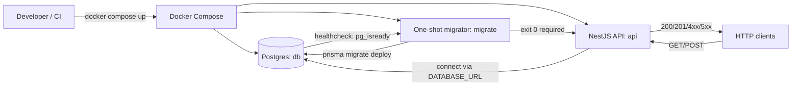
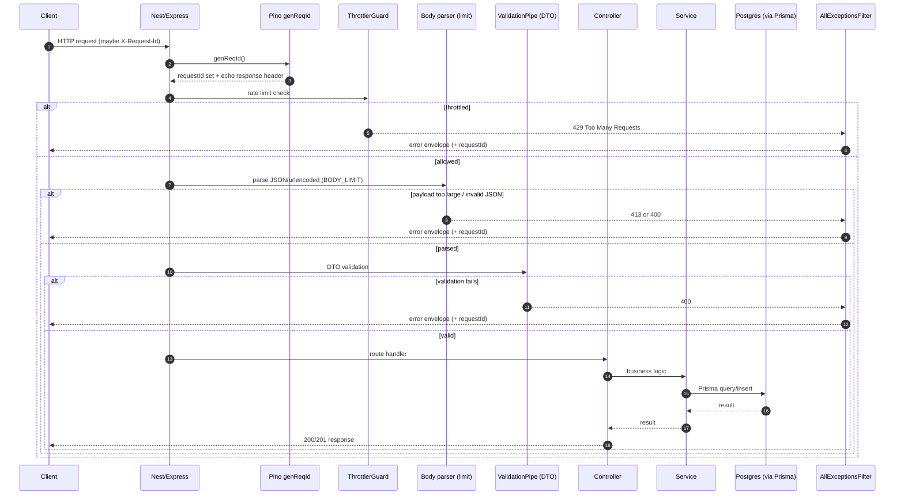
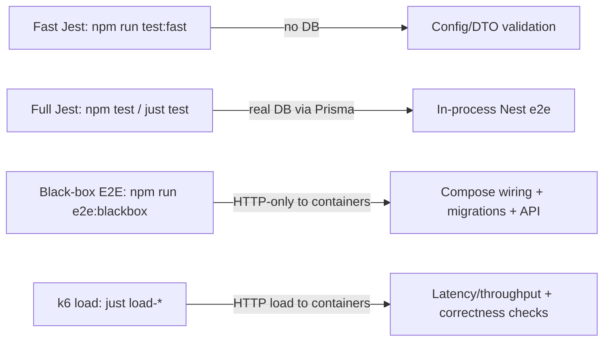

# interview-api

Simple REST API for a tree structure (NestJS + Postgres + Prisma).

## What you get

- NestJS API with a persistent TreeNode model (Postgres + Prisma)
- Docker Compose stack (db + one-shot migrator + api)
- Liveness/readiness endpoints (`/api/health`, `/api/ready`)
- OpenAPI/Swagger (`/api/docs`, `/api/openapi.json`) + snapshot guard
- Abuse protection baselines (request body limit + in-memory throttling)

## Ports

- API: `3000`
- Postgres: `5432`

## Prerequisites

- **[Docker & Docker Compose](https://docs.docker.com/get-docker/)**

  - Includes Docker Compose in Docker Desktop (macOS, Windows, Linux)

- **[asdf](https://asdf-vm.com/)** (recommended)

  - This repo pins Node version in `.tool-versions`
  - Install the Node.js plugin and run `asdf install`

- **[Node.js v22.15.0](https://nodejs.org/en/download)**

  - If you don’t use asdf, install Node manually

- **[`just`](https://github.com/casey/just#installation)**
  - A handy command runner for one-command workflows
  - Optional but recommended

## Configuration (env)

Copy `.env.example` to `.env` and tweak as needed:

```bash
cp .env.example .env
```

Most setups only need `DATABASE_URL`.

Common knobs (defaults shown):

- `API_PORT` (default: `3000`)
- `DATABASE_URL` (required for DB-backed runs)
- `BODY_LIMIT` (default: `100kb`) — max JSON/urlencoded body size (413 on overflow)
- `THROTTLE_TTL_SECONDS` (default: `60`), `THROTTLE_LIMIT` (default: `100`) — in-memory rate limits (429)
- `READY_DB_TIMEOUT_MS` (default: `500`) — bounds `/api/ready` DB ping
- `TREE_GET_MAX_NODES`, `TREE_GET_MAX_DEPTH` (default: unset) — rejects large/deep trees with 400 (no truncation)
- `DB_STATEMENT_TIMEOUT_MS` (default: unset) — injects Postgres `statement_timeout` via `DATABASE_URL` options
- `SERVER_KEEP_ALIVE_TIMEOUT_MS` (default: `5000`), `SERVER_HEADERS_TIMEOUT_MS` (default: `60000`), `SERVER_REQUEST_TIMEOUT_MS` (default: `300000`)

## Quickstart (recommended: Docker + `just`)

1. Create your local env file:

```bash
cp .env.example .env
```

2. Start the stack (db → migrate → api):

```bash
just up
```

3. Verify it’s up:

```bash
curl -sS http://localhost:${API_PORT:-3000}/api/health
curl -sS http://localhost:${API_PORT:-3000}/api/tree
```

Useful follow-ups:

```bash
just logs
just down
```

### Run with Docker (recommended)

If you don’t have `just` installed:

```bash
cp .env.example .env
docker compose up -d --build
curl -sS http://localhost:${API_PORT:-3000}/api/health
```

### Run locally (without Docker for the API)

If you want to run the Nest app directly on your machine, you still need Postgres running (for example via `docker compose up -d db`).

```bash
npm install
npx prisma migrate deploy
npm run start:dev
```



## API

Base URL: `http://localhost:${API_PORT:-3000}`

- `GET /api/tree` — list trees (nested)
- `POST /api/tree` — create node under parent
- `GET /api/health` — liveness (process up)
- `GET /api/ready` — readiness (DB reachable)

### OpenAPI / Swagger

- Swagger UI: `GET /api/docs`
- OpenAPI JSON: `GET /api/openapi.json`

This API supports URI versioning:

- Versioned: `/api/v1/...` (recommended for clients)
- Unversioned: `/api/...` (kept for backwards compatibility)

## GET /api/tree behavior (defaults + optional controls)

`GET /api/tree` is intentionally **unpaginated and unfiltered by default** for this assignment:

- It returns **all root nodes**, each with **full nested children**.
- No query params are required or applied by default.

### Optional query params

- Pagination (root-level only):
  - `page` (1-based)
  - `pageSize` (1..100)
  - Response body stays the canonical array of roots; pagination metadata is returned via headers.
- Filtering:
  - `rootId` returns a single root tree as a one-element array.
  - `rootId` cannot be combined with pagination.

### Pagination response headers

When pagination is used (`page` + `pageSize`), the response includes:

- `X-Total-Roots`
- `X-Page`
- `X-Page-Size`

### Operational limits (env)

`GET /api/tree` currently loads all nodes from the database and builds the nested response **in-memory**.

- Very large trees can increase memory usage and response size.
- This is acceptable for the assignment’s scope, but in a production setting you’d typically add guardrails (caps), timeouts, and/or opt-in root-level pagination.

Guardrails implemented in this repo (opt-in via env):

- `TREE_GET_MAX_NODES`: rejects `GET /api/tree` with 400 if total nodes exceeds the cap
- `TREE_GET_MAX_DEPTH`: rejects `GET /api/tree` with 400 if computed depth exceeds the cap

Notes:

- `TREE_GET_MAX_DEPTH` is a stability guardrail: extremely deep trees can trigger worst-case CPU/memory behavior and, if implemented with recursion, can cause a stack overflow. This repo avoids recursive traversal in the GET path and uses the depth cap to reject pathological inputs with a clear 400.

Additional hardening (env):

- **Node HTTP server timeouts** (configured in `src/main.ts` after `listen()`):
  - `SERVER_KEEP_ALIVE_TIMEOUT_MS`
  - `SERVER_HEADERS_TIMEOUT_MS` (must be greater than keep-alive; enforced)
  - `SERVER_REQUEST_TIMEOUT_MS`
- **Postgres statement timeout** (server-side):
  - `DB_STATEMENT_TIMEOUT_MS` injects `options=-c statement_timeout=...` into `DATABASE_URL` unless one is already present

### OpenAPI snapshot (CI guard)

This repo includes an OpenAPI snapshot to catch accidental contract drift.

- Check via tests: `npm test` (or `just test`)
- Update intentionally: `npm run openapi:snapshot` (or `just openapi-snapshot`)

## Error Responses

All API errors follow a single JSON envelope (clients can depend on these fields):

```json
{
  "statusCode": 400,
  "error": "Bad Request",
  "message": ["label should not be empty"],
  "path": "/api/tree",
  "timestamp": "2025-12-30T00:00:00.000Z",
  "requestId": "<id>"
}
```

Notes:

- `message` is either a string or a string array (validation errors are typically arrays).
- `requestId` is echoed from `X-Request-Id` when provided; otherwise generated.

### Examples

List all root trees (with nested children):

```bash
curl -sS http://localhost:${API_PORT:-3000}/api/tree
```

Create a child under an existing parent:

```bash
curl -sS -X POST http://localhost:${API_PORT:-3000}/api/tree \
  -H 'content-type: application/json' \
  -d '{"label":"child","parentId":1}'
```

Check liveness/readiness:

```bash
curl -sS http://localhost:${API_PORT:-3000}/api/health
curl -sS http://localhost:${API_PORT:-3000}/api/ready
```

Use versioned routes (recommended for clients):

```bash
curl -sS http://localhost:${API_PORT:-3000}/api/v1/tree
curl -sS http://localhost:${API_PORT:-3000}/api/v1/health
```

## Local workflows

- Start stack: `just up`
- Stop stack: `just down`
- Follow logs: `just logs`
- Run migrations: `just migrate`

## Docker Compose model

The stack is split into three services:

- `db`: Postgres
- `migrate`: one-shot job that runs Prisma migrations, then exits
- `api`: the NestJS server (does not run migrations itself)

Reset to a completely fresh local DB (destructive; deletes the volume):

```bash
docker compose down -v
```

## Testing

This repo uses a small number of test layers, each aimed at catching a different class of regressions.

### Fast tests (no DB)

Use this when you just want quick signal during iteration.

```bash
npm run test:fast
```

Covers:

- Config parsing/validation (env-driven behavior)
- DTO validation behavior (shape + common invalid inputs)

### Full test suite (DB-backed)

Runs Jest + Nest app in-process and uses a real Postgres database via Prisma.

```bash
just test
```

If you prefer not to use `just`:

```bash
docker compose up -d db
docker compose run --rm migrate
npm test
```

Covers:

- API behavior end-to-end (Nest + validation + filters + Prisma)
- Happy paths + common edge cases for `/api/tree`, `/api/health`, `/api/ready`
- Abuse-protection behaviors (e.g., `413` for body size limit, `429` for throttling)

### Black-box E2E (HTTP-only, via Docker Compose)

This validates the “real” container stack wiring (build, migrate job ordering, networking, HTTP behavior).

```bash
npm run e2e:blackbox
```

Notes:

- It runs against containers (not an in-process app).
- It uses a fresh Compose volume per run (it tears down with `down -v`).

### OpenAPI snapshot guard

The OpenAPI spec is tested against a committed snapshot to catch accidental contract drift.

- Check (included in `npm test`): `just openapi-check`
- Update intentionally: `just openapi-snapshot`

### Load testing (k6)

There are two “entry points”:

- Simple presets (seed + run + save report):

  - `just load-small`
  - `just load-wide`
  - `just load-deep`
  - `just load-stress`

- A small test plan runner:

  - `just load-test1` … `just load-test6` (read-focused)
  - `just load-write1` … `just load-write6` (write-focused)

Reports are saved to `load/k6/results/` as both an HTML dashboard and a `*.summary.json` export.

What “good” typically looks like (high-level):

- `http_req_failed` is ~0 (or at least stable and understood)
- `checks` are 100% (or failures are investigated)
- Latency percentiles (p95/p99) are stable across runs and don’t grow without bound

What “bad” typically looks like:

- Non-zero failures that keep rising (timeouts, connection errors, 5xx)
- Increasing p95/p99 over time at steady load (often DB saturation or queuing)
- “Correctness” check failures for write tests (indicates the API returned 201 but the tree shape didn’t match expectations)

## Lint

- Check: `npm run lint`
- Auto-fix: `npm run lint:fix`

## Git hooks

- Pre-commit runs: `npm run lint` and `npm run test:fast` (DB-free)
- Hooks are installed on `npm install` via the `prepare` script
- Bypass intentionally: `git commit --no-verify`

Troubleshooting:

- Hooks not running: verify `git config core.hooksPath` points to `.githooks`
- Reinstall hooks: `npm run prepare`

## CI

Workflows live under `.github/workflows/` and are intended to cover two concerns:

- Fast gate (lint + Jest + DB-backed tests)
- Docker stack smoke (build + compose wiring + HTTP behavior)

## Design notes

- **Tree model choice:** Adjacency list (`TreeNode` rows with an optional `parentId`) via a self-relation in Prisma.
- **Nested output approach:** `GET /api/tree` queries all nodes once and builds the nested response in-memory by mapping `id -> node` and attaching children to parents; only roots are returned.
- **Abuse protection:** request body size limit (`BODY_LIMIT`) and basic in-app throttling (`THROTTLE_TTL_SECONDS`, `THROTTLE_LIMIT`). Throttling is in-memory (single-instance) by design.

### Operational caps (GET /api/tree)

To keep `GET /api/tree` safe-by-default, the API enforces caps and rejects with `400` if exceeded (no truncation):

- Default `TREE_GET_MAX_NODES=100000`
- Default `TREE_GET_MAX_DEPTH=100`

Override these via env vars (see `.env.example`) if you need higher/lower limits.

## Future Improvements

- Further tighten Docker production hardening (e.g., non-root user, read-only filesystem, and CI image scanning).



---


